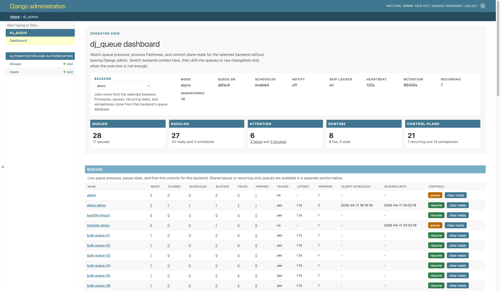
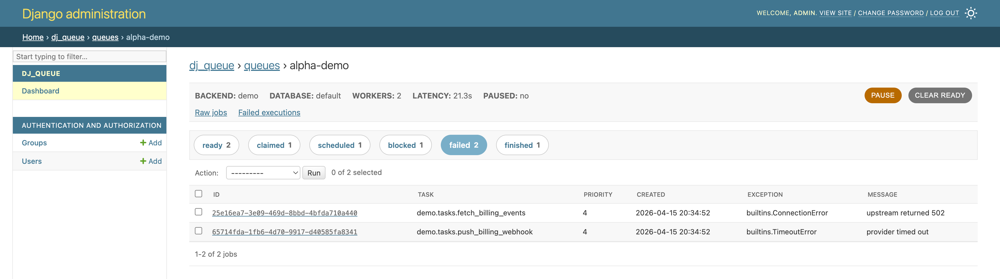

# dj_queue

[](https://github.com/coriocactus/dj_queue/actions/workflows/ci.yml)
[](https://pypi.org/project/dj-queue/)
[](https://djangopackages.org/packages/p/dj-queue/)


[](https://github.com/coriocactus/dj_queue/blob/main/LICENSE)

`dj_queue` is a database-backed task queue backend for the `django.tasks` framework.

It keeps the queue, live execution state, runtime metadata, and task results in your database.

- no Redis, RabbitMQ, or separate result store
- PostgreSQL is the first-class production backend
- MySQL 8+, MariaDB 10.6+, and SQLite are supported
- immediate, scheduled, recurring, and concurrency-limited work

`dj_queue` is inspired by Rails' [Solid Queue](https://github.com/rails/solid_queue),
shaped to fit Django's [task backend API](https://docs.djangoproject.com/en/6.0/topics/tasks/).

## Why dj_queue

Django applications already depend on the database as the durable system of
record. `dj_queue` lets background work follow the same model.

It has a narrow, explicit shape:

- application code uses Django's `@task` API
- `DjQueueBackend` stores jobs and results in Django-managed tables
- workers, dispatchers, and schedulers all share one operations layer
- PostgreSQL can use `LISTEN/NOTIFY` and `SKIP LOCKED` as optimizations
- polling remains the correctness path on every supported database

For detailed comparisons with Celery, RQ, Procrastinate, and other alternatives,
see [COMPARISONS.md](docs/COMPARISONS.md).

For benchmarks on enqueue, promotion, recurring, claiming, worker-drain, and concurrency-contention scenarios,
see [docs/benchmarks/](docs/benchmarks/) for the latest published reports.

## Installation

`dj_queue` requires Python 3.12+ and Django 6.0+.

Install the package:

```bash
pip install dj-queue
```

Optional extras:

```bash
pip install "dj-queue[postgres]"    # psycopg for PostgreSQL + LISTEN/NOTIFY
pip install "dj-queue[prometheus]"  # prometheus_client for /dj_queue/metrics
```

Add `dj_queue` to `INSTALLED_APPS`, register the router, and point Django's task
backend at `DjQueueBackend`:

```python
# settings.py

INSTALLED_APPS = [
  # ...
  "dj_queue",
]

DATABASE_ROUTERS = ["dj_queue.routers.DjQueueRouter"]

TASKS = {
  "default": {
    "BACKEND": "dj_queue.backend.DjQueueBackend",
    "QUEUES": [],
    "OPTIONS": {},
  },
}
```

The router is optional when using the default database, but harmless to include
and required for [multi-database setups](#multi-database-setup).

`dj_queue` can coexist with other Django task backends in the same `TASKS`
setting. It only manages aliases whose `BACKEND` is
`"dj_queue.backend.DjQueueBackend"`. If a `TASKS` alias points at some other
backend, `dj_queue` ignores that alias for runtime commands, admin/dashboard
selection, and observability.

Run migrations:

```bash
python manage.py migrate
```

`python manage.py dj_queue` checks for pending `dj_queue` migrations before it
starts workers. If another process is applying migrations during startup, the
runtime waits up to 60 seconds by default instead of starting against a stale
queue schema.

## Quick Start

Define a task with Django's `@task` decorator:

```python
# myapp/tasks.py
from django.tasks import task

@task
def add(a, b):
  return a + b
```

Start the `dj_queue` runtime in one terminal:

```bash
python manage.py dj_queue
```

Then enqueue work from another terminal or from your application code:

```python
from myapp.tasks import add

task_result = add.enqueue(3, 7)
print(task_result.id)
```

Read the result back through Django's task backend API:

```python
from myapp.tasks import add

fresh_result = add.get_backend().get_result(task_result.id)
print(fresh_result.status)
print(fresh_result.return_value)
```

When the worker has executed the job, `fresh_result.return_value` will be `10`.

## Admin Integration

If Django admin is installed, `dj_queue` adds an operator dashboard at
`/admin/dj_queue/dashboard/`.

- queue, process, recurring-task, and semaphore overview
- backend-aware dashboard and raw changelists
- queue controls: pause, resume, clear ready
- job actions: enqueue a fresh copy of any stored job
- failed jobs: retry and discard from list and detail views
- unschedule dynamic recurring tasks
- queue drill-down pages for state-specific inspection

**Dashboard overview**



**Queue drill-down**



## Common Patterns

### Scheduled jobs

Use `run_after` to keep work out of the ready queue until a future time:

```python
from datetime import timedelta
from django.utils import timezone
from myapp.tasks import send_digest

future = timezone.now() + timedelta(hours=1)
send_digest.using(run_after=future).enqueue("daily")
```

### Priorities and named queues

Use `priority` and `queue_name` on the task call itself:

```python
from myapp.tasks import deliver_email

deliver_email.using(queue_name="email", priority=10).enqueue("welcome")
deliver_email.using(queue_name="email", priority=-5).enqueue("digest")
```

### Bulk enqueue

Use `enqueue_all()` when you need one backend call to submit many jobs:

```python
from myapp.tasks import process_item

results = process_item.get_backend().enqueue_all(
  [(process_item, [item_id], {}) for item_id in range(5)]
)
```

### Enqueue after commit

`enqueue()` writes immediately and returns a real persisted task result ID. If a
task depends on rows that are still inside the current transaction, use
`enqueue_on_commit()`:

```python
from django.db import transaction
from dj_queue.api import enqueue_on_commit
from myapp.tasks import send_receipt

with transaction.atomic():
  order = create_order()
  enqueue_on_commit(send_receipt, order.id)
```

`dj_queue` does not defer inserts implicitly or return placeholder result IDs for
uncommitted work. Use the helper above or `transaction.on_commit()` directly
when the job must not exist before commit.

### Examples

The repository ships real runnable examples in `examples/`.

Recommended entry points:

- [examples/ex01_basic_enqueue.py](examples/ex01_basic_enqueue.py)
- [examples/ex07_basic_enqueue_on_commit.py](examples/ex07_basic_enqueue_on_commit.py)
- [examples/ex08_basic_recurring.py](examples/ex08_basic_recurring.py)
- [examples/ex20_advanced_concurrency.py](examples/ex20_advanced_concurrency.py)
- [examples/ex21_advanced_queue_control.py](examples/ex21_advanced_queue_control.py)
- [examples/ex24_advanced_multi_db.py](examples/ex24_advanced_multi_db.py)
- [examples/ex25_advanced_asgi.py](examples/ex25_advanced_asgi.py)

The [examples index](examples/README.md) lists the full progression.

## How it Works

`python manage.py dj_queue` starts a supervisor for one backend alias.

Job lifecycle:

`enqueue -> ready | scheduled | blocked -> claimed -> successful | failed`

The runtime has four moving parts:

- `supervisor`: boots and stops the runtime
- `workers`: claim ready jobs and execute them
- `dispatchers`: promote due scheduled jobs and run concurrency maintenance
- `scheduler`: enqueue recurring tasks and finished-job cleanup when configured

Useful command variants:

```bash
python manage.py dj_queue
python manage.py dj_queue --mode async
python manage.py dj_queue --backend <alias>
python manage.py dj_queue --only-work
python manage.py dj_queue --only-dispatch
python manage.py dj_queue --skip-recurring
python manage.py dj_queue --migration-wait-timeout 120
```

Notes:

- `fork` is the default standalone mode
- startup waits up to 60 seconds for pending `dj_queue` migrations to finish;
  use `--migration-wait-timeout 0` to fail fast instead
- `async` is also supported as a standalone mode and runs supervised actors in threads inside one process
- `--backend` targets a non-default backend alias
- `--only-work` starts workers without dispatchers or scheduler
- `--only-dispatch` starts dispatchers without workers or scheduler
- `--skip-recurring` starts without the scheduler

`fork` runs each worker, dispatcher, and scheduler as a separate OS process.
`async` runs them as threads in one process, i.e., lower memory, less isolation.
Default is `fork`. Use standalone `async` when you want one-process supervision
with lower memory use and less isolation, or embedded `async` when `dj_queue`
should live inside an ASGI or Gunicorn server process.

In `async` mode, worker `processes > 1` is ignored and normalized to `1`.

### Claiming order

- within one selected queue, higher numeric `priority` is claimed first
- across multiple queue selectors, selector order wins
- `"*"` matches all queues
- selectors ending in `*` match queue prefixes such as `email*`

For example, a worker configured with `queues: ["email", "default"]` will
prefer ready work from `email` before `default`, even if `default` contains
higher-priority rows.

If you combine queue order with priorities, queue selector order still wins
across queues. Prefer one primary scheduling mechanism per worker when you can.

### Signals and recovery

In standalone mode, both `fork` and `async` `python manage.py dj_queue` supervisors own runtime signal handling:

- `SIGTERM` and `SIGINT` request graceful shutdown
- `SIGQUIT` requests immediate process exit through normal Python cleanup
- `shutdown_timeout` controls how long the runtime waits for in-flight work to drain
- `supervisor_pidfile` can prevent duplicate standalone supervisors on one host

Runners heartbeat into the queue database. If claimed work is left behind,
`dj_queue` preserves it as failed work that operators can inspect and retry:

- `ProcessExitError`: a supervised runner exited unexpectedly
- `ProcessPrunedError`: a runner heartbeat expired and the process was pruned
- `ProcessMissingError`: claimed work was found without its registered process

Use `python manage.py dj_queue_health` to check whether any fresh runtime
process rows exist for a backend.

### Data Contract

Job payloads and persisted return values are stored in JSON columns, so they must be JSON round-trippable.

- enqueueing args or kwargs that cannot round-trip through JSON fails immediately
- returning a non-JSON-serializable value marks the job failed instead of
  leaving it claimed forever

If you need to pass model instances, files, or custom objects, store them elsewhere and pass identifiers or serialized data instead.

## Database Support

| Backend | Support level | Notes |
|---|---|---|
| PostgreSQL | first-class | polling, `SKIP LOCKED`, and optional `LISTEN/NOTIFY` |
| MySQL 8+ | supported | polling plus `SKIP LOCKED` |
| MariaDB 10.6+ | supported | polling plus `SKIP LOCKED` |
| SQLite | supported with limits | polling only, serialized writes, no `SKIP LOCKED`, no `LISTEN/NOTIFY`; practical for development, CI, and smaller deployments |

For MySQL or MariaDB, install and configure a Django-compatible driver following Django's database docs.

Other Django database vendors are rejected explicitly.

Polling is the portability path everywhere. Backend-specific features improve latency and throughput but are not correctness requirements.

For production PostgreSQL operational guidance, see [Postgres Queue Health](#postgres-queue-health).

## Recurring Tasks

`dj_queue` supports both static recurring tasks from settings and dynamic
recurring tasks managed at runtime.

Recurring tasks persist their next due cursor after the first scheduler poll so
large recurring sets do not need cron parsing on every tick for rows that are not
due yet.

### Static recurring tasks

Define recurring tasks in `TASKS[...]["OPTIONS"]["recurring"]`:

```python
TASKS = {
  "default": {
    "BACKEND": "dj_queue.backend.DjQueueBackend",
    "QUEUES": [],
    "OPTIONS": {
      "recurring": {
        "nightly_cleanup": {
          "task_path": "myapp.tasks.cleanup",
          "schedule": "0 3 * * *",
          "queue_name": "maintenance",
          "priority": -5,
          "description": "nightly cleanup",
        },
      },
    },
  },
}
```

Static recurring definitions are synced when the scheduler runner starts, then
normal polling uses the persisted recurring rows and their `next_run_at` cursor.

### Dynamic recurring tasks

Create, update, and remove recurring tasks at runtime:

```python
from dj_queue.api import schedule_recurring_task, unschedule_recurring_task

schedule_recurring_task(
  key="tenant_42_report",
  task_path="myapp.tasks.send_report",
  schedule="0 * * * *",
  queue_name="reports",
  priority=5,
)

unschedule_recurring_task("tenant_42_report")
```

Dynamic recurring tasks require
`TASKS[backend_alias]["OPTIONS"]["scheduler"]["dynamic_tasks_enabled"] = True`
or the equivalent `scheduler.dynamic_tasks_enabled = true` in the optional TOML
config.

The scheduler is part of the normal `dj_queue` runtime. You do not run a separate recurring service.

Notes:

- schedules are [Fugit](https://github.com/floraison/fugit#fugitcron)-style cron or cronish natural-language expressions
- cron supports five fields or an optional leading seconds field, presets like `@daily`, optional timezone suffixes, wraparound ranges, `L`/`last` and negative monthdays, weekday `#` and `%` extensions, and normal day-of-month/day-of-week OR semantics
- add `&` to either day field to require day-of-month and day-of-week to both match
- natural-language schedules support `every`, `at`, `on`, and `from` forms such as `every day at noon`, `every weekday at five`, `every 5 minutes`, `every month on day 2 at 10:00`, `from monday to friday at 9`, and `at minute 5`
- natural interval counts must fit inside the cron field they map to; misleading forms such as `every 90 seconds`, `every 90 minutes`, and `every 24 hours` are rejected
- natural-language schedules that expand to multiple cron expressions, such as `every day at 16:15 and 18:30`, are treated as the union of those schedules
- recurring task keys are scoped per backend alias
- only dynamic tasks can be unscheduled at runtime; unscheduling a static task returns `0`
- Django admin exposes the same unschedule operation on recurring-task list and detail views
- multiple schedulers sharing the same recurring config dedupe firing in the database
- finished-job cleanup runs as internal scheduler maintenance when `preserve_finished_jobs=True` and `clear_finished_jobs_after` is set
- failed-job cleanup can run as internal scheduler maintenance when `clear_failed_jobs_after` is set
- recurring execution reservation cleanup can run as internal scheduler maintenance when `clear_recurring_executions_after` is set

## Concurrency Controls

Tasks can opt into database-backed concurrency limits.

`django.tasks` has no standard way to pass backend-specific options through the
`@task` decorator, so `dj_queue` reads them as attributes on the wrapped function:

```python
from django.tasks import task

@task
def sync_account(account_id, action):
  return f"{account_id}:{action}"

sync_account.func.concurrency_key = "account:{account_id}"
sync_account.func.concurrency_limit = 1
sync_account.func.concurrency_duration = 60
sync_account.func.on_conflict = "block"
```

With this configuration:

- the first matching job can run immediately
- later jobs for the same key can block until capacity is released
- `on_conflict = "discard"` turns the same pattern into singleton-style work

Semaphore rows remain shared on the queue database. If you want per-backend
isolation for a limit, express that in the `concurrency_key` itself rather than
expecting one semaphore namespace per backend alias.

## Queue Operations

`QueueInfo` exposes operational queue controls without bypassing the queue
tables:

```python
from dj_queue.api import QueueInfo, claim_ready_jobs, execute_claimed_job

orders = QueueInfo("orders")

print(orders.size)
print(orders.latency)
print(orders.paused)

orders.pause()
orders.resume()
orders.clear()

claimed_jobs = claim_ready_jobs(limit=1, queues=["orders"])
if claimed_jobs:
  execute_claimed_job(claimed_jobs[0])
```

`QueueInfo.all()` discovers queues through the same read model as the dashboard
and reuses that snapshot for `size`, `latency`, and `paused` until a queue
mutation invalidates it.

Notes:

- pausing a queue stops future claims, not enqueueing or already-claimed work
- pause rows are scoped per backend alias
- `clear()` discards ready jobs only
- pass `backend_alias=` when you want to target a non-default `TASKS` alias
- `claim_ready_jobs()` returns `ClaimedJob` objects, so inspect `claimed_job.job` for the persisted row
- the low-level claim/execute helpers are exposed on `dj_queue.api` for scripts and examples

Operational commands:

```bash
python manage.py dj_queue_health
python manage.py dj_queue_health --max-age 120
python manage.py dj_queue_prune --older-than 86400
python manage.py dj_queue_prune --failed-older-than 604800
python manage.py dj_queue_prune --recurring-older-than 2592000
python manage.py dj_queue_prune --task-path myapp.tasks.cleanup
python manage.py dj_queue_prune --task-key nightly_cleanup
python manage.py dj_queue_postgres_autovacuum
```

The health, prune, and PostgreSQL autovacuum commands accept `--backend` to target a non-default backend alias.

For `dj_queue_prune`, `--task-path` filters finished and failed job cleanup by
task import path, while `--task-key` filters recurring execution cleanup by
recurring task key.

## Failed Jobs

When a task raises, `dj_queue` keeps the job and its failed execution row in the
queue database, including the exception class, message, and traceback.

You can retry and discard failed jobs through Django admin, and any raw job
detail page can enqueue a fresh copy of that stored job. The failed-job actions
also stay available through the public API:

```python
from dj_queue.api import (
  discard_blocked_jobs,
  discard_failed_job,
  discard_failed_jobs,
  discard_ready_jobs,
  discard_scheduled_jobs,
  retry_failed_job,
  retry_failed_jobs,
  schedule_failed_job_retry,
)

retry_failed_job(job_id)
schedule_failed_job_retry(job_id, retry_at=retry_at)
discard_failed_job(job_id)
retry_failed_jobs(job_ids=[job_id_a, job_id_b], batch_size=2)
discard_ready_jobs(job_ids=[ready_job_id], batch_size=1)
discard_failed_jobs(batch_size=500)
discard_scheduled_jobs(job_ids=[scheduled_job_id], batch_size=1)
discard_blocked_jobs(job_ids=[blocked_job_id], batch_size=1)
```

Failures stay inspectable until you act on them. Scheduled failed retries stay
failed until a dispatcher promotes rows whose `retry_at` is due; `dj_queue` does
not add an automatic retry policy or backoff engine.

## Errors When Enqueuing

`DjQueueBackend.enqueue()` raises `dj_queue.exceptions.EnqueueError` for
backend-side validation failures instead of silently dropping work.

Common reasons include:

- args or kwargs are not JSON round-trippable
- the task targets a queue outside a non-empty `QUEUES` allow-list
- `concurrency_key` is set without `concurrency_limit`
- `concurrency_limit` or `concurrency_duration` is not a positive integer
- `concurrency_key` cannot be resolved from the enqueue arguments
- `concurrency_key` does not resolve to a non-empty string up to 255 chars
- `on_conflict` is not `"block"` or `"discard"`

```python
from dj_queue.exceptions import EnqueueError

try:
  sync_account.enqueue(account_id, "refresh")
except EnqueueError as exc:
  handle_enqueue_error(exc)
```

Task execution errors are different: they become failed jobs and stay
inspectable in the queue database.

## Lifecycle Hooks

Register hooks before starting the runtime, typically during Django startup.
Each callback receives the live supervisor or runner instance.

```python
from dj_queue.hooks import on_start, on_worker_start, register_hook

@on_start
def supervisor_started(process):
  print(process.name)

@on_worker_start
def worker_started(process):
  print(process.metadata)

@register_hook("scheduler.exit")
def scheduler_exited(process):
  print(process.name)
```

Available hook helpers:

- supervisor: `on_start`, `on_stop`, `on_exit`
- worker: `on_worker_start`, `on_worker_stop`, `on_worker_exit`
- dispatcher: `on_dispatcher_start`, `on_dispatcher_stop`, `on_dispatcher_exit`
- scheduler: `on_scheduler_start`, `on_scheduler_stop`, `on_scheduler_exit`
- generic events: `register_hook("worker.start")`, `register_hook("dispatcher.stop")`, and so on

Notes:

- hooks fire in registration order
- hook failures do not block later hooks
- hook failures are isolated and routed through `on_thread_error`

## Multi-Database Setup

`dj_queue` can keep queue tables on a dedicated database alias:

```python
DATABASES = {
  "default": {
    "ENGINE": "django.db.backends.postgresql",
    "NAME": "app",
  },
  "queue": {
    "ENGINE": "django.db.backends.postgresql",
    "NAME": "queue",
  },
}

DATABASE_ROUTERS = ["dj_queue.routers.DjQueueRouter"]

TASKS = {
  "default": {
    "BACKEND": "dj_queue.backend.DjQueueBackend",
    "QUEUES": [],
    "OPTIONS": {
      "database_alias": "queue",
    },
  },
}
```

Run your normal application migrations on `default`, then migrate `dj_queue`
onto the queue database:

```bash
# migrate dj_queue on its queue alias first so django doesn't mark it applied on default
python manage.py migrate dj_queue --database queue
python manage.py migrate
```

With this setup, `dj_queue`'s ORM queries and raw SQL helpers stay on the queue
database.

## Backend Coexistence

Projects can mix `dj_queue` with other Django task backends in the same `TASKS` mapping:

```python
TASKS = {
  "default": {
    "BACKEND": "dj_queue.backend.DjQueueBackend",
    "QUEUES": [],
    "OPTIONS": {
      "database_alias": "queue",
    },
  },
  "external": {
    "BACKEND": "some_other_backend.Backend",
    "QUEUES": [],
    "OPTIONS": {},
  },
}
```

In that setup:

- jobs with `backend="default"` are `dj_queue`'s responsibility
- jobs with `backend="external"` are the other backend's responsibility
- `dj_queue` admin, dashboard, `/dj_queue/stats.json`, `/dj_queue/metrics`, and `manage.py dj_queue --backend ...` only operate on `dj_queue` aliases

Notes:

- if `TASKS` is empty or unset, `dj_queue` still exposes one implicit `default` alias using built-in defaults
- if `TASKS` is non-empty, `dj_queue` only manages aliases whose `BACKEND` is explicitly `"dj_queue.backend.DjQueueBackend"`

## Postgres Queue Health

Operational and configuration guidance for scaling with `dj_queue` in
production PostgreSQL deployments, covering dedicated database setup, retention
policy, and autovacuum tuning.

- Use a dedicated queue database via `database_alias`. Keep reporting and
  long-running transactions off the queue database.
- Consider a positive Django `CONN_MAX_AGE` for the queue database connection
  path. It can materially improve worker throughput by reusing worker-thread
  connections, but size PostgreSQL `max_connections` or your connection pool
  for the total web, runner, and worker-thread footprint first. `dj_queue`
  logs `connection_budget.warning` on startup when the local worker footprint
  appears close to PostgreSQL connection capacity.
- Keep retention short. Set `preserve_finished_jobs = False` if you do not need
  successful results. Otherwise use bounded `clear_finished_jobs_after`,
  `clear_failed_jobs_after`, and `clear_recurring_executions_after` values.
- Run `python manage.py dj_queue_prune` regularly for stricter cleanup.
- Keep `use_skip_locked = True` and `listen_notify = True` unless you have a
  specific reason not to.
- Tune autovacuum for `dj_queue_jobs` and the high-churn
  `dj_queue_*_executions` tables, often default OLTP settings are too
  conservative for queue workloads.
- Use `python manage.py dj_queue_postgres_autovacuum` to print reviewable
  `ALTER TABLE ... SET (...)` SQL for queue-table autovacuum storage
  parameters. `dj_queue` does not apply these settings in migrations.
- Keep transactions short across workers and the rest of your app. Long-lived
  transactions pin dead tuples and delay vacuum.
- Monitor dead tuples, autovacuum frequency, and long-running queries before
  reaching for partitioning or bulk-ingest paths.

## Embedded Server Mode

`dj_queue` can run inside an existing server process via embedded async
supervision.

### ASGI

Wrap your ASGI application with `DjQueueLifespan`:

```python
from django.core.asgi import get_asgi_application
from dj_queue.contrib.asgi import DjQueueLifespan

django_application = get_asgi_application()
application = DjQueueLifespan(django_application, forward_wrapped_lifespan=False)
```

Set `forward_wrapped_lifespan=False` when the wrapped app does not implement the
ASGI lifespan protocol itself, such as Django's plain `get_asgi_application()`.

### Gunicorn

Import the provided hooks in your Gunicorn config:

```python
# gunicorn.conf.py
from dj_queue.contrib.gunicorn import post_fork, worker_exit
```

Both embedded integrations use `AsyncSupervisor(standalone=False)` and leave
signal handling to the host server.

## Configuration

### Queues, backends, and databases

`dj_queue` has three separate routing concepts. Keep them distinct:

- `queue_name`: what kind of work this job is. Use it to route lanes inside one backend, such as `email`, `webhooks`, or `search-index`.
- `backend_alias`: which logical queue system owns the work. Use it when you want separate runtime config, recurring tasks, pause and process visibility, retention, or admin scoping.
- `database_alias`: where that backend's queue tables and runtime activity live. Use it when you want a dedicated database connection path or stronger storage isolation.

Common setup choices:

- one backend, one database: simplest and usually enough
- one backend, separate queue database: good when you want dedicated queue connections
- multiple backends, same database: good for logical and operational separation without another database
- multiple backends, multiple databases: use when you need stronger isolation and accept more migration and deployment complexity

`TASKS[backend_alias]["QUEUES"]` is an enqueue allow-list. Leave it as `[]` to
allow any queue name, or set an exact list to reject work outside those lanes.

### Deployment topology

Once migrations are in place, start processing jobs with `python manage.py dj_queue`
on the machine that should do the work. With the default configuration, this
starts the supervisor, workers, dispatcher, and scheduler for the default
backend alias and processes all queues.

For most deployments, start with a standalone `dj_queue` process. Reach for a
dedicated queue database before you reach for embedded mode.

- single database, standalone process: easiest way to start. Use the app
  database and run `python manage.py dj_queue`
- dedicated queue database: recommended production default. Keep queue tables
  and runtime traffic on `database_alias`. See [Multi-Database Setup](#multi-database-setup)
- embedded server mode: run `dj_queue` inside ASGI or Gunicorn when you want
  queue execution colocated with the server process. See [Embedded Server Mode](#embedded-server-mode)

For small deployments, running `dj_queue` on the same machine as the web server
is often enough. When you need more capacity, multiple machines can point at
the same queue database. Full `python manage.py dj_queue` instances coordinate
through database locking, so workers and dispatchers share load safely and
recurring firing stays deduplicated across schedulers.

In practice, keep recurring settings identical on every full node and prefer one
full instance plus additional `python manage.py dj_queue --only-work` nodes.
Add `--only-dispatch` nodes only when you need more scheduled-job promotion or
concurrency-maintenance throughput.

### Options

The main configuration lives in `TASKS[backend_alias]["OPTIONS"]`.

No top-level `OPTIONS` key is required. Omit a key to use its default. Static
`recurring` entries are the exception: each named recurring task requires
`task_path` and `schedule`.

Global options:

| Option | Default | Meaning |
|---|---|---|
| `mode` | `"fork"` | standalone runtime mode, either `"fork"` or `"async"` |
| `workers` | `[{"queues": "*", "threads": 3, "processes": 1, "polling_interval": 0.1, "prefetch_multiplier": 2}]` | worker topology and queue selectors |
| `dispatchers` | `[{"batch_size": 500, "polling_interval": 1, "concurrency_maintenance": true, "concurrency_maintenance_interval": 600}]` | scheduled promotion and concurrency maintenance |
| `scheduler` | `{"dynamic_tasks_enabled": false, "polling_interval": 5}` | dynamic recurring polling; the scheduler only starts when recurring or cleanup work exists |
| `recurring` | `{}` | static recurring task definitions keyed by name |
| `database_alias` | `"default"` | database alias for queue tables and runtime activity |
| `preserve_finished_jobs` | `true` | keep successful jobs for result lookup and retention cleanup |
| `clear_finished_jobs_after` | `86400` | seconds before finished successful jobs are cleaned up |
| `clear_failed_jobs_after` | `null` | optional failed-job retention window in seconds |
| `clear_recurring_executions_after` | `null` | optional recurring reservation retention window in seconds |
| `default_concurrency_duration` | `180` | default semaphore TTL in seconds |
| `use_skip_locked` | `true` | use `SKIP LOCKED` when the active backend supports it |
| `listen_notify` | `true` | PostgreSQL-only worker wakeup optimization layered on top of polling |
| `silence_polling` | `true` | suppress `dj_queue`'s own poll-cycle noise without mutating Django's global SQL logger |
| `process_heartbeat_interval` | `60` | seconds between process heartbeat writes |
| `process_alive_threshold` | `300` | seconds before a process row is stale |
| `shutdown_timeout` | `5` | graceful drain window before standalone shutdown gives up on waiting |
| `supervisor_pidfile` | `null` | optional pidfile guard for standalone supervisors |
| `on_thread_error` | `null` | dotted callback path for runtime infrastructure exceptions |

Worker entry options:

| Option | Default | Meaning |
|---|---|---|
| `queues` | `"*"` | queue selector or selectors; `"*"` means all queues |
| `threads` | `3` | worker threads per worker process |
| `processes` | `1` | worker processes in `fork` mode; normalized to `1` in `async` mode |
| `polling_interval` | `0.1` | seconds between worker polls |
| `prefetch_multiplier` | `2` | upper bound on claimed work; each poll still claims no more jobs than currently idle worker threads |

Dispatcher entry options:

| Option | Default | Meaning |
|---|---|---|
| `batch_size` | `500` | maximum scheduled or blocked rows to promote per batch |
| `polling_interval` | `1` | seconds between dispatcher polls |
| `concurrency_maintenance` | `true` | run expired semaphore and blocked-job maintenance |
| `concurrency_maintenance_interval` | `600` | seconds between maintenance passes; `0` means every poll |

Scheduler entry options:

| Option | Default | Meaning |
|---|---|---|
| `dynamic_tasks_enabled` | `false` | load dynamic recurring tasks from the database |
| `polling_interval` | `5` | seconds between scheduler polls |

Recurring entry options:

| Option | Default | Meaning |
|---|---|---|
| `task_path` | none | required dotted import path for the task to enqueue |
| `schedule` | none | required cron or supported Fugit-style cronish schedule |
| `args` | `[]` | positional arguments for the task |
| `kwargs` | `{}` | keyword arguments for the task |
| `queue_name` | `"default"` | queue used for jobs created from this recurring task |
| `priority` | `0` | priority used for jobs created from this recurring task |
| `description` | `""` | operator-facing description |

On PostgreSQL, `listen_notify` uses the same Django PostgreSQL driver
configuration as the main database connection. Install a compatible driver in
your project, or use `dj-queue[postgres]` to pull in `psycopg`.

### Precedence

Configuration precedence is explicit:

- CLI overrides
- environment variables
- TOML file pointed to by `DJ_QUEUE_CONFIG`
- Django `TASKS` settings

### TOML file config

```bash
# via cli
python manage.py dj_queue --config /etc/dj_queue.toml

# or via environment variable
DJ_QUEUE_CONFIG=/etc/dj_queue.toml python manage.py dj_queue
```

The TOML file is an overlay on `TASKS[backend_alias]["OPTIONS"]`. It supports
two shapes:

- a flat mapping of option values for the selected backend alias
- a `backends` mapping keyed by backend alias, where only the selected alias is applied

TOML has no `null` value. Omit optional settings to keep their existing defaults.

Flat mapping example:

```toml
mode = "async"
database_alias = "queue"
preserve_finished_jobs = true
clear_finished_jobs_after = 86400
listen_notify = true
silence_polling = true

[[workers]]
queues = ["default", "email*"]
threads = 8
processes = 1
polling_interval = 0.1
prefetch_multiplier = 2

[[dispatchers]]
batch_size = 500
polling_interval = 1
concurrency_maintenance = true
concurrency_maintenance_interval = 600

[scheduler]
dynamic_tasks_enabled = true
polling_interval = 5

[recurring.nightly_cleanup]
task_path = "myapp.tasks.cleanup"
schedule = "0 3 * * *"
queue_name = "maintenance"
priority = -5
description = "nightly cleanup"
```

Multi-backend overlay example:

```toml
[backends.default]
mode = "async"
database_alias = "default"

[[backends.default.workers]]
queues = ["default", "email*"]
threads = 8
processes = 1
polling_interval = 0.1

[backends.critical]
mode = "fork"
database_alias = "queue"

[[backends.critical.workers]]
queues = ["alerts", "critical-review"]
threads = 2
processes = 1
polling_interval = 0.05
```

Environment overrides currently supported by `dj_queue` itself:

- `DJ_QUEUE_CONFIG`
- `DJ_QUEUE_MODE`
- `DJ_QUEUE_SKIP_RECURRING`

### Runtime infrastructure errors

Set `on_thread_error` to a dotted callable path when you want custom handling
for queue-runtime exceptions:

```python
TASKS = {
  "default": {
    "BACKEND": "dj_queue.backend.DjQueueBackend",
    "QUEUES": [],
    "OPTIONS": {
      "on_thread_error": "myapp.queue.report_runtime_error",
    },
  },
}
```

The callback receives the raised exception object for background runtime issues
such as hook failures, heartbeat failures, notify-watcher failures, and managed
runner crashes. It is not used for exceptions raised by your task code; those
become failed jobs instead.

## Monitoring

Queue statistics are available in JSON via `/dj_queue/stats.json` and in
Prometheus text format via `/dj_queue/metrics`.

These observability endpoints only report `dj_queue`-managed backend aliases and
ignore aliases configured for some other task backend.

Include `dj_queue.urls` to expose them:

```python
urlpatterns += [path("dj_queue/", include("dj_queue.urls"))]
```

The `/dj_queue/metrics` endpoint requires the `prometheus` extra:

```bash
pip install "dj-queue[prometheus]"
```

If the extra is missing, the endpoint returns `503` with an installation hint.

Exported metric families:

- `dj_queue_queue_jobs{backend,queue,state}`
- `dj_queue_queue_paused{backend,queue}`
- `dj_queue_queue_latency_seconds{backend,queue}`
- `dj_queue_queue_live_workers{backend,queue}`
- `dj_queue_runner_processes{backend,status}`
- `dj_queue_runner_processes_by_kind{backend,kind,status}`
- `dj_queue_recurring_tasks{backend}`
- `dj_queue_semaphores{queue_database}`
- `dj_queue_process_rows{backend}`
- `dj_queue_failed_jobs{backend}`
- `dj_queue_failed_job_oldest_age_seconds{backend}`
- `dj_queue_failed_job_retention_seconds{backend}`
- `dj_queue_failed_jobs_over_retention{backend}`

Both endpoints support bearer token authentication. Set
`DJ_QUEUE_OBSERVABILITY_TOKEN` in `settings.py` and include it as
`Authorization: Bearer <token>`. Leave it unset if you protect these URLs at
the network or proxy layer.

## License

MIT
